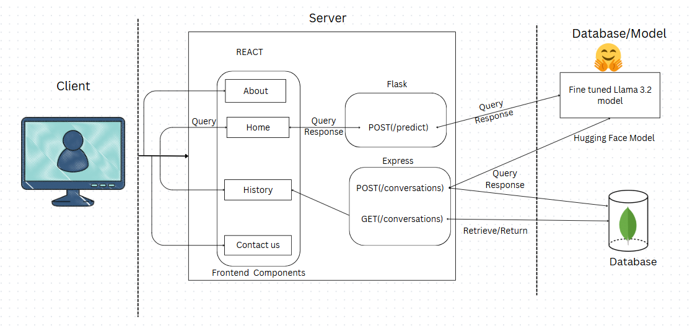
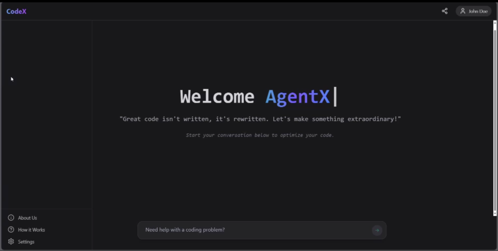

# CodeOptimisationGenAI
Design and develop a web application that allows users to input programming-related queries in languages such as C, C++, Java, Python, and HTML. The web app should generate optimized code solutions that focus on reducing operational costs.

## Architecture Diagram



The diagram above illustrates the high-level architecture of the project, showing the interaction between the frontend and backend.

---

## **Setup Instructions**

### **Frontend**
---

1. Navigate to the `frontend` directory:
   ```bash
   cd frontend
2. Install the required dependencies:
    ```bash
    npm install
3. Start the development server:
   ```bash
   npm run dev
### **Backend**
---
The backend of this project is built using **Flask** and is configured to run via a Jupyter Notebook.

### **Steps to Start the Backend**

1. Open the `backend_code.ipynb` file in a Jupyter Notebook or a compatible environment.

2. Execute all cells in the notebook to start the Flask server.  
   - Ensure that all required dependencies are installed (e.g., Flask, ngrok, etc.).

3. After running the backend, **ngrok** will generate a public URL to expose the local Flask server.  
   - Copy the generated ngrok link.

4. Update the ngrok link in the frontend code:  
   - Navigate to `Frontend/services/api.js`.  
   - Replace the existing API base URL with the new ngrok link, like so:
     ```javascript
     const API_BASE_URL = "https://your-new-ngrok-link.ngrok.io";
     ```

---

## **Important Note**

- **ngrok is only used for development purposes.**  
  Avoid using this setup in a production environment due to potential security risks.

- Every time the backend is restarted, ngrok generates a new URL. Ensure to update the frontend with the new ngrok link to maintain connectivity.

---

### **Frontend UI Images**
---


## Team Members

Meet the amazing team behind this project:


|  |  |  |  
|:---:|:---:|:---:|  
| [Akshay Nagamalla](https://github.com/AkshayNagamalla) | [Hemanth Kumar](https://github.com/hemanth123) | [Srinidhi](https://github.com/Srinidhi-Chodavarapu) |  

|  |  |  |  
|:---:|:---:|:---:|  
| [Sharvani](https://github.com/Sharvani-30) | [Vaishnavi](https://github.com/vaishnavichikkudu) | [Pardiv Kamishetty](https://github.com/pardivkamishetty) |  
